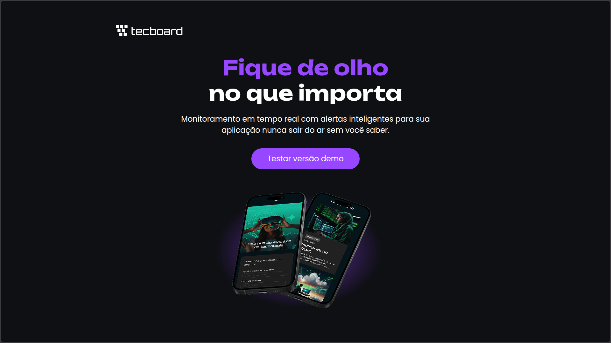

# 🚀 TecBoard


## 📝 Project Description

**TecBoard** is a responsive landing page developed as a study project during a course by [Alura](https://www.alura.com.br/). The project focuses on applying **web programming best practices** and mastering **responsive design** techniques. 

> [!IMPORTANT]
> This is a **fictional project** created for educational purposes. The services, monitoring features, and alerts mentioned on the page are part of the UI/UX study and do not represent a real application.

The main goal was to build a modern, professional-looking interface that adapts perfectly to any device, simulating a real-world SaaS landing page. 📊

## 📸 Project Preview

Here is a look at the project:

<!-- Replace the URL below with your actual screenshot path or URL -->


## ✨ Learning Objectives & Features

*   **📱 Responsive Design:** Implementation of mobile-first concepts and `@media queries` to ensure the site looks great on desktops, tablets, and smartphones.
*   **🎨 Modern UI/UX:** Use of a dark theme, custom typography, and balanced spacing to create a professional landing page feel.
*   **🛠️ Clean Code:** Applying semantic HTML5 and organized CSS3 to follow industry standards.
*   **🎯 Interactive Elements:** Styled buttons and hover effects to simulate user engagement.

## 🛠️ Technologies Used

*   **HTML5:** Semantic structure for better SEO and accessibility.
*   **CSS3:** Advanced styling, Flexbox, and Responsive Design.
*   **Google Fonts:** Integration of 'Unbounded' and 'Poppins' for a premium look.

## 🚀 How to Run the Project Locally

1.  **Clone the repository:**
    ```bash
    git clone https://github.com/MarceloMangelli/tecboard.git
    ```
2.  **Navigate to the directory:**
    ```bash
    cd tecboard
    ```
3.  **Open the site:**
    Open `index.html` in your favorite browser.

## 🌐 Live Demo

You can check out the live version here:  
[https://tecboard-mu-two.vercel.app/](https://tecboard-mu-two.vercel.app/)

## 👤 Author

**Marcelo Mangelli** - High school student and web development student. 👨‍💻

## 🎓 Credits

This project was developed as part of the educational curriculum provided by **Alura**.

## 📄 License

This project is licensed under the MIT License - see the [LICENSE](LICENSE) file for details.